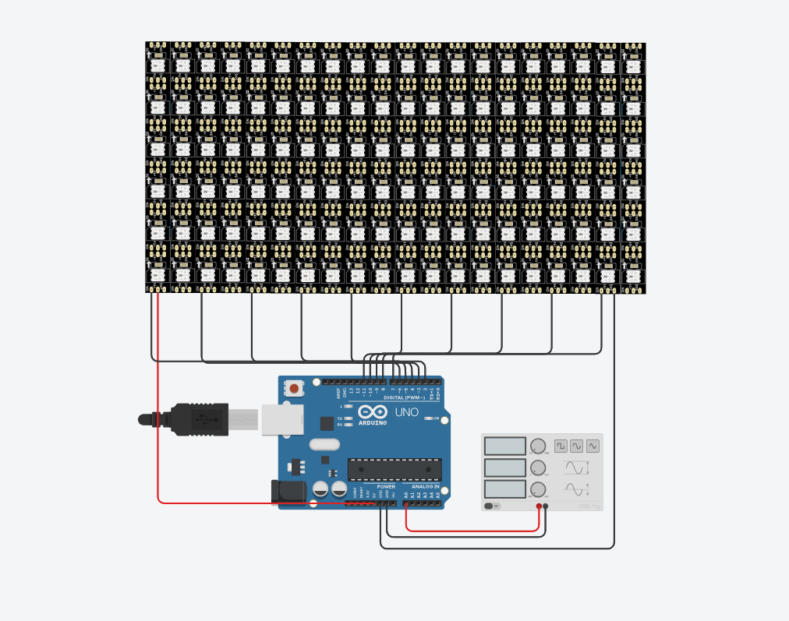
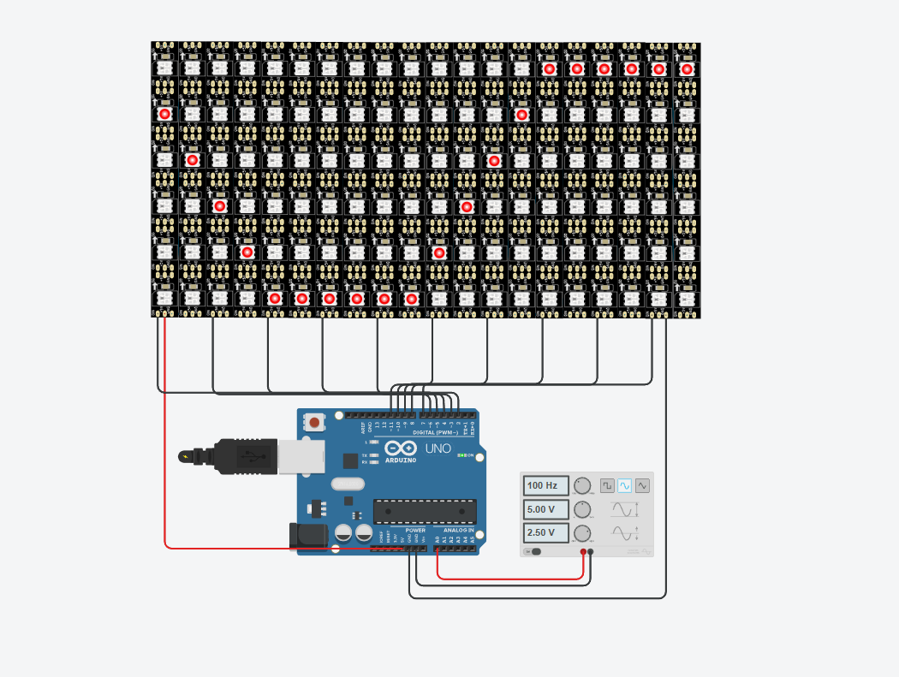

# 🎨 Osciloscópio com LEDs RGB Programáveis

## 📑 Descrição do Projeto

Projeto **didático e de baixo custo** para auxiliar alunos a compreenderem **formas de onda** utilizando **LEDs RGB programáveis**.

  

---

## 🧰 Materiais Necessários

- 🧠 **Microcontrolador:** Arduino, ESP32 ou ESP8266
- 💡 **LEDs RGB Programáveis:** 120 unidades (Ex.: WS2812B)
- 🔋 **Fonte de alimentação adequada**
- 🧵 **Jumpers** e (opcional) **protoboard**

---

## 📦 Instalação da Biblioteca

Este projeto utiliza a biblioteca ➕ **Adafruit NeoPixel**.

👉 Para instalar, acesse o **Gerenciador de Bibliotecas** do Arduino IDE ou clique no link:  
[🔗 Adafruit NeoPixel GitHub](https://github.com/adafruit/Adafruit_NeoPixel)

---

## 💻 Simulador Online

Teste o projeto diretamente no 👉 [Tinkercad](https://www.tinkercad.com/).

  

---

## 📚 Referências

- 📖 [O que é Osciloscópio e para que serve?](https://www.mundodaeletrica.com.br/o-que-e-osciloscopio-e-para-que-serve/#google_vignette)

---

## ⚖️ Licença

🚫 Projeto de **uso educacional** e **sem fins lucrativos**.  
Sinta-se livre para utilizar e modificar para fins acadêmicos e aprendizado.

---

